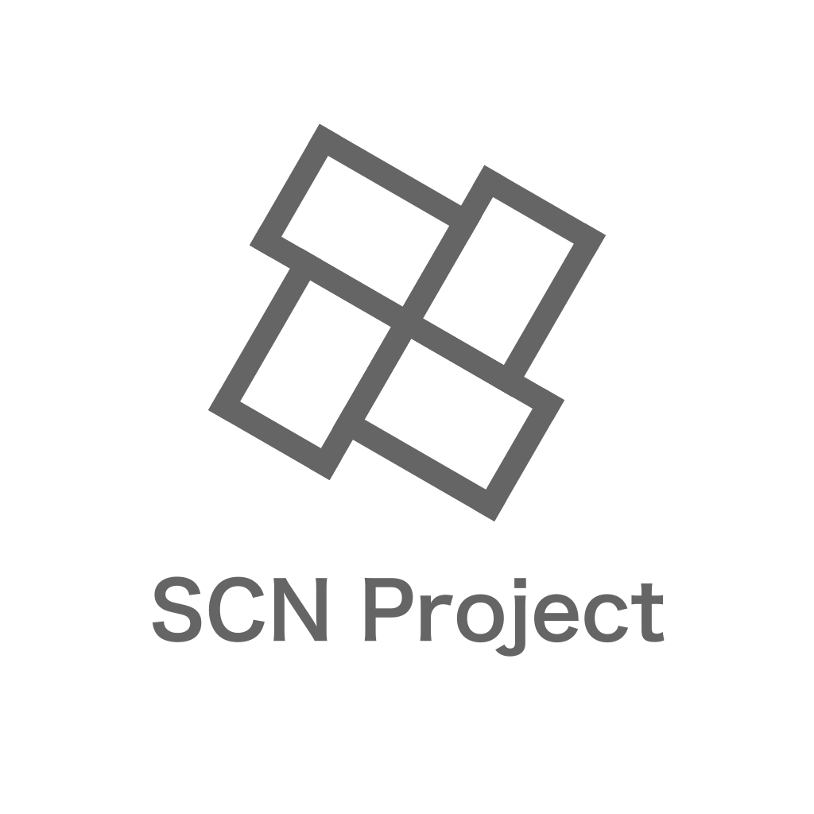

<h1 align="center">Hey there! 👋</h1>
## About Me

🌟 Hi, I'm Shihiro Saida, the Founder of the **[@SCN Project](https://twitter.com/SCN_Project)** 🚀. 
🎉 I'm all about connecting with awesome people, so don't be shy—let's connect on social media! 

## Let's Get Social 🌐

 

### Explore SCN Project! 🚀

Feel free to explore my projects and say hello! Let's make the coding world a more exciting and colorful place together! 🌈✨

  

  

